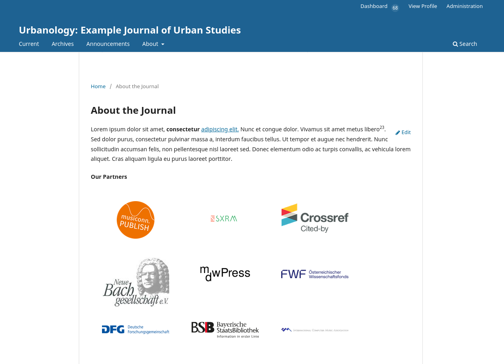
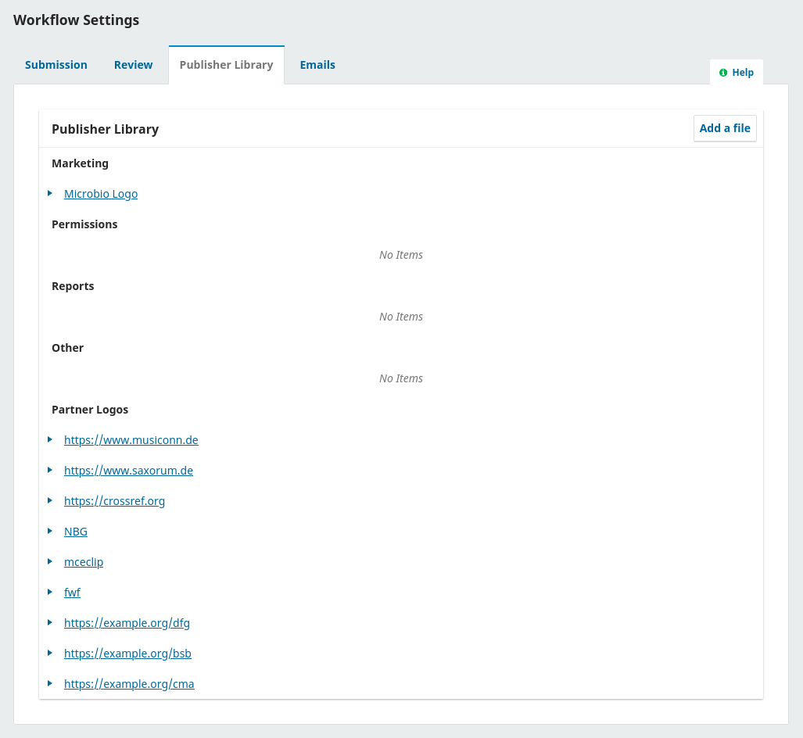

# Partner Logos

A plugin for [OJS](https://pkp.sfu.ca/software/ojs/), [OMP](https://pkp.sfu.ca/software/omp/) or [OPS](https://pkp.sfu.ca/software/ops/) to display a gallery of logos from partners or supporting organizations.

## Usage

This plugin adds a new category to the **Publisher Library** for Partner Logos.

After activating the plugin, follow these steps to show partner logos on your journal.

1. Upload images to the **Partner Logos** category at **Settings > Workflow > Publisher Library**. The *Public Access* checkbox must be checked.
2. To make the image link to a website, set the file's **Name** to a URL, like `https://example.org`.
3. To add an accessible `alt` tag to the image, enter a **Description** for the file.
4. Add the `{$partnerLogos}` shortcode to one of the following settings fields.
   1. Settings > Journal > Masthead > Editorial Team
   2. Settings > Journal > Masthead > About the Journal
   3. Settings > Website > Appearance > Setup > Page Footer
   4. Settings > Website > Appearance > Advanced > Additional Content
   5. Or add it to a custom page at Settings > Website > Setup > Navigation > Add Item.

## Credits

This plugin was created thanks to funding from SLUB Dresden for the [Individualize Theme by Publia](https://github.com/NateWr/individualizeTheme).
